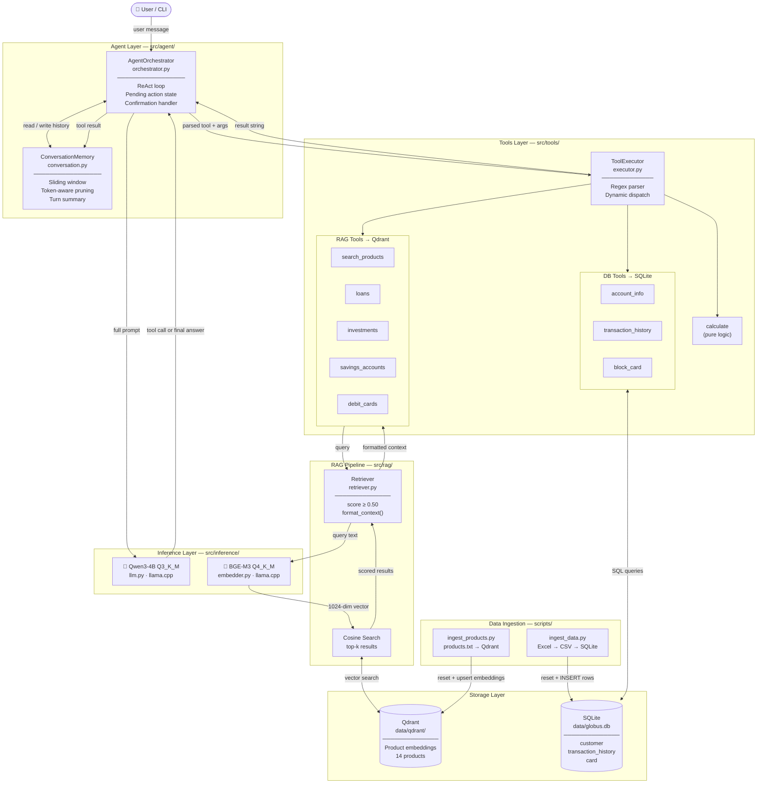

# Conversational AI Agent

A fully offline conversational AI agent, built with local LLM inference. Handles customer inquiries about products, accounts, transactions, and card services.

## Features

- **Product Information**: Loans, investments, savings accounts, debit cards
- **Account Services**: Balance inquiries, account details, transaction history
- **Card Management**: List cards, block lost/stolen cards (with multi-card handling and confirmation step)
- **RAG-powered Retrieval**: Semantic product search via Qdrant vector store
- **Natural Conversations**: Sliding window context for coherent multi-turn dialogue
- **Fully Offline**: Runs on CPU/edge devices without internet dependency

## Architecture



## Tech Stack

| Component | Technology |
|-----------|------------|
| LLM | Qwen3-4B (GGUF, Q3_K_M) |
| Embeddings | BGE-M3 (GGUF, Q4_K_M) |
| Inference | llama.cpp (llama-cpp-python) |
| Vector Store | Qdrant (embedded mode) |
| Database | SQLite |
| Language | Python 3.10+ |

## Project Structure

```
conversational-ai-agent/
├── config/
│   └── settings.py              # Model paths, DB config, LLM settings
├── src/
│   ├── inference/
│   │   ├── llm.py               # Qwen3 LLM wrapper (llama.cpp)
│   │   └── embedder.py          # BGE-M3 embedder wrapper
│   ├── memory/
│   │   ├── conversation.py      # Sliding window conversation memory
│   │   └── vector_store.py      # Qdrant client (embedded)
│   ├── tools/
│   │   ├── registry.py          # Tool schema & registry
│   │   ├── executor.py          # Tool call parser & executor
│   │   └── banking.py           # All banking tool implementations
│   ├── rag/
│   │   ├── retriever.py         # Semantic retrieval (embed → search → filter)
│   │   └── ingest.py            # products.txt parser & Qdrant ingest
│   ├── db/
│   │   ├── schema.py            # SQLite schema + init/reset helpers
│   │   ├── repository.py        # Data access layer (Customer, Transaction, Card)
│   │   └── ingest_excel.py      # Excel → CSV export + SQLite ingest
│   └── agent/
│       ├── orchestrator.py      # Main ReAct agent loop
│       └── prompts.py           # System prompt, confirmation templates
├── scripts/
│   ├── ingest_products.py       # Clear Qdrant and re-ingest products.txt
│   └── ingest_data.py           # Clear SQLite, export CSVs, re-ingest Excel
├── models/                      # GGUF model files (not committed)
│   ├── Qwen_Qwen3-4B-Q3_K_M.gguf
│   └── bge-m3-Q4_K_M.gguf
├── data/
│   ├── globus.db                # SQLite database
│   ├── qdrant/                  # Qdrant embedded storage
│   └── csv/                     # Exported CSVs (generated by ingest_data.py)
├── products.txt                 # Product catalog source
├── customer_and_banking_data.xlsx
├── main.py                      # CLI entry point
├── requirements.txt
└── README.md
```

## Prerequisites

- Python 3.10+
- 8GB+ RAM recommended

## Installation

### 1. Clone and setup virtual environment

```bash
cd /path/to/conversational-ai-agent
python -m venv .venv
source .venv/bin/activate       # Linux/Mac
# or: .venv\Scripts\activate    # Windows
```

### 2. Install dependencies

```bash
pip install -r requirements.txt
```

### 3. Download models

```bash
mkdir -p models

# LLM — Qwen3-4B (Q3_K_M, ~2.0 GB)
wget https://huggingface.co/bartowski/Qwen_Qwen3-4B-GGUF/resolve/main/Qwen_Qwen3-4B-Q3_K_M.gguf \
     -O models/Qwen_Qwen3-4B-Q3_K_M.gguf

# Embeddings — BGE-M3 (Q4_K_M, ~1.1 GB)
wget https://huggingface.co/gpustack/bge-m3-GGUF/resolve/main/bge-m3-Q4_K_M.gguf \
     -O models/bge-m3-Q4_K_M.gguf
```

After downloading:
```
models/
├── Qwen_Qwen3-4B-Q3_K_M.gguf     # LLM
└── bge-m3-Q4_K_M.gguf             # Embeddings
```

### 4. Qdrant (embedded)

No setup needed. Qdrant runs embedded and stores data locally in `data/qdrant/`.

---

## Data Ingestion

### Ingest product catalog (Qdrant)

Parses `products.txt`, generates embeddings, and stores them in Qdrant. Clears any existing vector data first.

```bash
python scripts/ingest_products.py
```

### Ingest customer data (SQLite)

Exports each sheet of the Excel file to `data/csv/`, resets the SQLite database, then ingests all sheets. Prints the full schema and row counts at the end.

```bash
python scripts/ingest_data.py
```

#### Expected Excel sheets

**Sheet: Customer**
| ID | Account_No | Account_Name | Currency | Account_Type | Product_Type | Product_Description | Current_Balance | Account_Open_Date |
|----|------------|--------------|----------|--------------|--------------|---------------------|-----------------|-------------------|

**Sheet: Transaction**
| Account_No | Transaction_Date | Transaction_Type | Transaction_Amount | Destination_Account | Narration | Destination_Account_Bank | Transaction_Status | Failure_Reason |
|------------|------------------|------------------|-------------------|---------------------|-----------|--------------------------|-------------------|----------------|

**Sheet: Card**
| Account_No | Card_Issuer | Card_Type | Card_Activation_Date | Status |
|------------|-------------|-----------|---------------------|--------|

Date format accepted: `DD/MM/YYYY HH:MM`, `DD/MM/YYYY HH:MM:SS`, `YYYY-MM-DD`

#### SQLite schema & relationships

```
customer
├── id, account_no (PK), account_name, currency
├── account_type, product_type, product_description
├── current_balance, account_open_date
│
├──< transaction_history  (FK: account_no)
│       id, transaction_date, transaction_type, transaction_amount
│       destination_account, narration, destination_bank
│       transaction_status, failure_reason
│
└──< card  (FK: account_no)
        id, card_issuer, card_type, card_last_four
        card_activation_date, status
```

---

## Usage

### Start the agent

```bash
python main.py
```

### Commands

| Input | Description |
|-------|-------------|
| Any question | Handled by the AI agent |
| `reset` | Clear conversation history |
| `quit` | Exit |

---

## Agent Flows

### Flow 1 — Product/Interest Query

> *"What package do you have that gives interest?"*

No account details needed. Pure RAG lookup.

```
User message
    │
    ▼
AgentOrchestrator.run()
    ├─ build_prompt()  ──► LLM
    │                        └─ emits: TOOL: search_products(query="...")
    ▼
ToolExecutor.parse_tool_call()
    │
    ▼
search_products_handler(query)
    ├─ Embedder (BGE-M3) converts query → [1024-dim vector]
    ├─ Qdrant cosine search  (top 3, score ≥ 0.50)
    └─ format_context() → "Relevant information: ..."
    │
    ▼
memory.add("tool", result)
    │
    ▼
LLM sees tool result → generates final natural-language answer
    │
    ▼
Response returned to user
```

**Iteration count:** 2 (tool call → final answer)
**DB hit:** Qdrant only
**Identity required:** No

---

### Flow 2 — Card Blocking (stolen/lost wallet)

> *"My wallet was stolen, I need to block my card"*

Requires identity verification, DB lookup, and explicit confirmation.

```
User message
    │
    ▼
AgentOrchestrator.run()
    ├─ is_confirmation_response()? → No
    ├─ build_prompt() ──► LLM
    │                        └─ no account_no yet → asks customer
    │
User provides account number
    │
    ▼
LLM → TOOL: block_card(action="check_multiple", account_no)
    │
    ├─ 1 active card  → SINGLE_CARD:...
    │       └─ LLM calls block_card(action="block", last_four, reason="stolen")
    │
    └─ N active cards → MULTIPLE_CARDS:...
            └─ Orchestrator returns MULTI_CARD_CLARIFICATION to user
               User picks one → LLM calls block_card(action="block", ...)
    │
    ▼
block_card(action="block", confirmed=False)
    └─ returns CONFIRM_REQUIRED
    │
    ▼
Orchestrator stores pending_action, returns CARD_BLOCK_CONFIRMATION to user:
    "Confirm blocking Visa ending in 4532? Reply Yes or No."
    │
User replies "Yes"
    │
    ▼
_is_confirmation_response() → True
_handle_confirmation()
    └─ block_card(confirmed=True)
    └─ CardRepository.block_card()  ← SQLite UPDATE card SET status='Blocked'
    │
    ▼
SUCCESS response with reference number and next steps
```

**Iteration count:** 3–4 (identity → check → confirm → block)
**DB hit:** SQLite (`card`, `customer`)
**Identity required:** Yes (account number)

---

### Flow comparison

| | Product Query | Card Block |
|---|---|---|
| Identity required | No | Yes (account number) |
| Data source | Qdrant (RAG) | SQLite |
| Confirmation step | No | Yes |
| Pending action state | No | Yes |
| Typical iterations | 2 | 3–4 |

---

## Available Tools

| Tool | Description | Data Source |
|------|-------------|-------------|
| `search_products` | Semantic product catalog search | Qdrant |
| `loans` | Loan product details, compare, eligibility | Qdrant |
| `investments` | Investment products and indicative rates | Qdrant |
| `savings_accounts` | Account types, features, requirements | Qdrant |
| `debit_cards` | Card info, features, how to apply | Qdrant |
| `account_info` | Customer balance and account details | SQLite |
| `transaction_history` | Recent transactions and summary | SQLite |
| `block_card` | Card blocking with multi-card + confirmation | SQLite |
| `calculate` | Loan EMI, investment return, simple interest | Logic |

---

## Configuration

Edit `config/settings.py`:

```python
# Model paths
LLM_MODEL_PATH = BASE_DIR / "models" / "Qwen_Qwen3-4B-Q3_K_M.gguf"
EMBED_MODEL_PATH = BASE_DIR / "models" / "bge-m3-Q4_K_M.gguf"

# LLM settings
LLM_CONTEXT_SIZE = 4096
LLM_MAX_TOKENS = 512
LLM_TEMPERATURE = 0.7
LLM_THREADS = 4       # Adjust to your CPU core count

# Embedding settings
EMBED_DIMENSION = 1024  # BGE-M3

# Qdrant (embedded - no Docker)
QDRANT_PATH = BASE_DIR / "data" / "qdrant"
QDRANT_COLLECTION = "globus_ai"

# Agent
MAX_AGENT_ITERATIONS = 10
```

---

## Troubleshooting

### llama-cpp-python build fails
```bash
pip install cmake
CMAKE_ARGS="-DLLAMA_BLAS=ON" pip install llama-cpp-python --no-cache-dir
```

### Re-ingest everything from scratch
```bash
python scripts/ingest_products.py   # resets Qdrant + re-ingests products.txt
python scripts/ingest_data.py       # resets SQLite + exports CSVs + re-ingests Excel
```

### Qdrant errors (manual reset)
```bash
rm -rf data/qdrant
python scripts/ingest_products.py
```

### Out of memory
- Reduce `LLM_CONTEXT_SIZE` in `config/settings.py`
- Use a smaller quantization (e.g. `Q2_K` instead of `Q3_K_M`)
- Reduce `LLM_THREADS`

---

## License

Internal use — Open

## Support

For issues, contact the development team.
